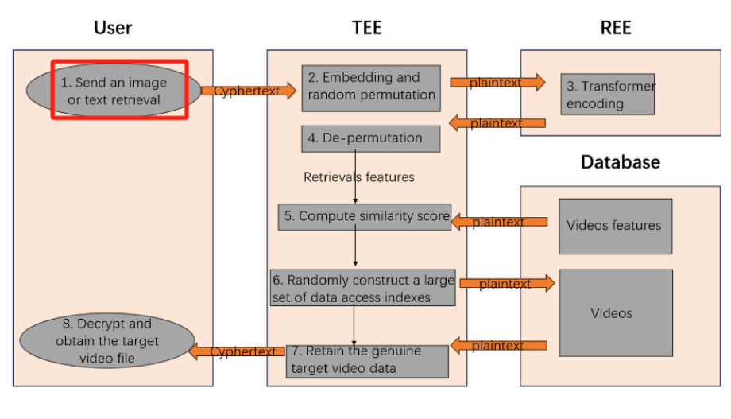
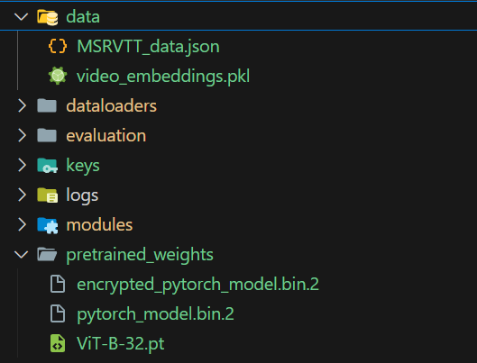

# CLIP2VideoDeploy

A simple Flask deployment for retrieving similar videos from an image or text.

### Inference Flow



---

### Demo Video 


---

### Setup Instructions

#### 1. **On TEE (Trusted Execution Environment)**:
Run the following command to start the inference server:
```bash
python ./tee/app_i2v.py
```
#### 2. **On REE (Remote Execution Environment)**:
Run the necessary scripts:
```bash
python ./ree/attestation_worker.py  
python ./ree/db.py  
python ./ree/worker.py  
```

> Make sure you have all the necessary model files and embeddings. Refer to this image for guidance:  
> 

---

### To Run T2V Model

Change the command in TEE to:

python ./tee/app_t2v.py

> **Note**: There is a known bug in the T2V model, but the logic is very similar to `i2v`, so it should be easy to fix.

---

### Optional Arguments

You can disable additional features by passing these arguments to app_i2v.py (by default, they are enabled):

- `distributed false`: Disable distributed inference.
- `use_db false`: Disable database usage.
- `use_attest false`: Disable attestation.


Example:
```bash
python ./tee/app_i2v.py --distributed false --use_db false --use_attest false
```

---

### Useful Commands

- To kill a process running on port 8080:
```bash
kill -9 $(lsof -i :8080 | awk 'NR!=1 {print $2}')
```
---

### Final Notes

For more details, please refer to the full demo video and the relevant codebase.
